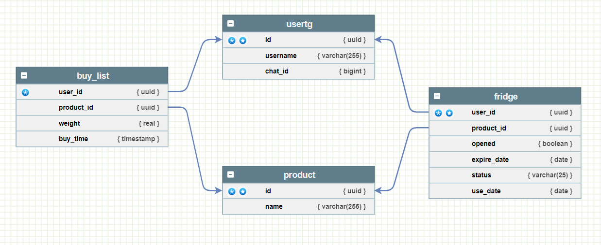

# Telegram Buy list Bot

Telegram bot that allows you to manage your purchases and monitor the shelf life of products.

The bot is running on the server and can be accessed at: [@gogogobuybot](https://t.me/gogogobuybot)

## What he can do?

<ol>
<li>Add item to buy list</li>
<li>Add an item to the fridge</li>
<li>Open the product, move the product to the final status</li>
<li>View a list of products sorted alphabetically/by nearest expiration date and alphabetically</li>
<li>View a list of previously used products</li>
<li>View your stats</li>
<li>Notify you when you need to buy a product</li>
<li>Notify you that the product is about to go bad</li>
</ol>

## If you want to run your own instance of the bot

1. Clone the repo

2. Add a token from BotFather to env variable in docker-compose.yml

```yaml
version: '3.9'

services:
  buy_list_bot:
    container_name: golang_container
    environment:
     - TGTOKEN= your token
     - DBUSER= your username for db
     - DBPASSWORD= your password for db
     - DBHOST= your host for db
     - DBNAME= your db name
     - DBPORT= your db port name
    tty: true
    build: .
    ports:
      - 8080:8080
...
```

3. Run the container

```bash
docker-compose up 
```

# Database schema:

